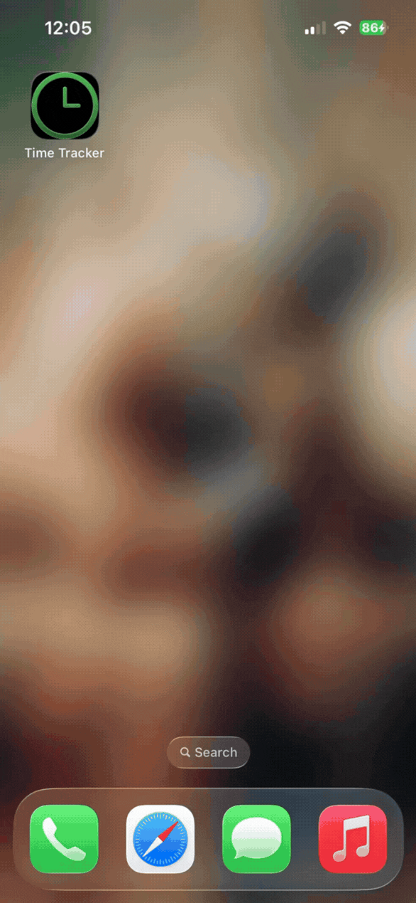

# Personal Time Tracker

[](https://opensource.org/licenses/MIT)
[](https://nodejs.org/)
[](https://www.docker.com/)

A lightweight, Dockerized general-purpose time clock and hours tracker with a React frontend and Node.js backend that syncs with Google Sheets. Designed to be hosted locally and accessed via Tailscale or other VPN on mobile for personal use.

<p align="center">
  
</p>

This application helps you track time spent on various tasks, jobs, or personal projects with a modern, simple interface.

## Prerequisites: Google Cloud Setup (One-Time)

This setup is required to allow the application to connect to your Google Sheet. Despite setting up through an external provider, it is free.

### A. Create Project & Enable APIs

1.  Go to the [Google Cloud Console](https://console.cloud.google.com/).
2.  Create a new project (e.g., `time-tracker`).
3.  **Enable Google Sheets API:**
    - Search for "Google Sheets API" or [Click Here](https://console.developers.google.com/apis/api/sheets.googleapis.com/overview).
    - Click **ENABLE**.
4.  **Enable Google Drive API:**
    - Search for "Google Drive API" or [Click Here](https://console.developers.google.com/apis/api/drive.googleapis.com/metrics).
    - Click **ENABLE**.
    - _Note: This is required for the backend to find and interact with the sheet._

### B. Create Service Account & Keys

1.  Go to **IAM & Admin** > **Service Accounts**.
2.  Click **+ CREATE SERVICE ACCOUNT**.
    - Name: `tracker-bot` (or similar).
    - Click **Done**.
3.  Click on the newly created service account's email address.
4.  Go to the **KEYS** tab.
5.  Click **ADD KEY** > **Create new key** > **JSON**.
6.  A JSON file will download. Save it in the root of this project folder. The filename will be long (e.g., `time-tracker-xxxxxxxxxxxx.json`).

### C. Share the Sheet

1.  Create a new Google Sheet.
2.  Click **Share** (top right).
3.  Copy the **Service Account Email** (from step 2.3) and paste it into the Share box.
4.  Give it **Editor** permission.
5.  **Important:** Copy the Sheet ID from the URL. The URL looks like this: `https://docs.google.com/spreadsheets/d/THIS_IS_THE_SHEET_ID/edit`.

---

## Installation & Usage

### A. Configuration (`.env` file)

Create a file named `.env` in the root of the project and add the following content.

```ini
# The full filename of the JSON key file you downloaded
CREDS_FILE="time-tracker-xxxxxxxxxxxx.json"

# The name of the tab in your Google Sheet where entries are logged
G_SHEET_NAME="Hours Tracker"

# The ID of your Google Sheet (from the URL)
G_SHEET_ID="YOUR_GOOGLE_SHEET_ID_HERE"

# The local IP to bind the container to (127.0.0.1 is recommended)
LOCAL_IP=127.0.0.1

# Your active Tailscale IP address for the host machine
TAILSCALE_IP=100.x.x.x
```

### B. Build the Docker Image

Open a terminal in the project folder and run:

```bash
docker build -t time-tracker .
```

### C. Run the Container

The project includes helper scripts for both bash and PowerShell to run the container.

**Option A: Local-Only Mode**

By default, the container binds only to `127.0.0.1`. This makes the app accessible on the host machine at `http://localhost:8501`.

- **Bash (Linux/macOS):**
  ```bash
  ./run_local.sh
  ```
- **PowerShell (Windows):**
  ```powershell
  ./run_local.ps1
  ```

**Option B: Local Network Mode (Phone Access)**

To access the app on your local network (e.g. from your phone on the same Wi-Fi) without using Tailscale, pass the network flag. The script automatically detects your machine's local IP address and binds the container to it.

- **Bash (Linux/macOS):**
  ```bash
  ./run_local.sh --network
  ```
- **PowerShell (Windows):**
  ```powershell
  ./run_local.ps1 -Network
  ```

**Option C: Tailscale Mode**

This makes the app accessible _only_ via your Tailscale network. This requires `TAILSCALE_IP` to be set to an active IP on your machine.

- **Bash (Linux/macOS):**
  ```bash
  ./run_tailscale.sh
  ```
- **PowerShell (Windows):**
  ```powershell
  ./run_tailscale.ps1
  ```

### 4. Accessing the App

- **Computer:** `http://localhost:8501` (under Local-Only Mode)
- **Local Network (e.g., Phone):** `http://<YOUR_DETECTED_IP>:8501` (under Network Mode)
- **Phone (via Tailscale):** `http://<YOUR_TAILSCALE_IP>:8501` (under Tailscale Mode)

---

## Adding to Your Phone's Home Screen

For quick access, you can add the web app to your phone's home screen.

### On iOS

1.  Open Safari and navigate to the app's URL (e.g., `http://<YOUR_TAILSCALE_IP>:8501`).
2.  Tap the **Share** button (a square with an arrow pointing up).
3.  Scroll down and tap **Add to Home Screen**.
4.  Name the shortcut (e.g., "Time Tracker") and tap **Add**.

### On Android

1.  Open Chrome and navigate to the app's URL (e.g., `http://<YOUR_TAILSCALE_IP>:8501`).
2.  Tap the **three-dot menu** in the top-right corner.
3.  Tap **Add to Home screen**.
4.  Name the shortcut and tap **Add**.

---

## Development

If you want to run the application locally for development without Docker:

### A. Prerequisites

- [Node.js](https://nodejs.org/) (v18 or later)

### B. Setup

1.  **Install Backend Dependencies:**
    ```bash
    cd server
    npm install
    cd ..
    ```
2.  **Install Frontend Dependencies:**
    ```bash
    cd client
    npm install
    cd ..
    ```
3.  Ensure your `.env` file is configured correctly as described above.

### C. Running the Dev Servers

1.  **Start the Backend Server:**

    ```bash
    cd server
    npm start
    ```

    The backend will run on `http://localhost:3001`.

2.  **Start the Frontend Dev Server:**
    Open a **new terminal** window.
    ```bash
    cd client
    npm start
    ```
    The frontend will open automatically at `http://localhost:3000`. The development server is configured to proxy API requests to the backend.
